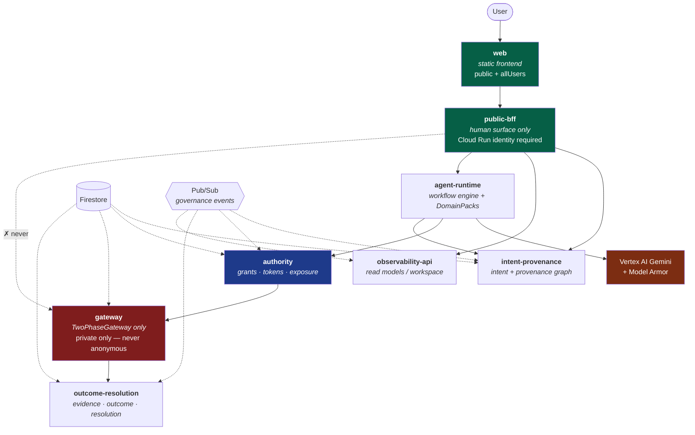
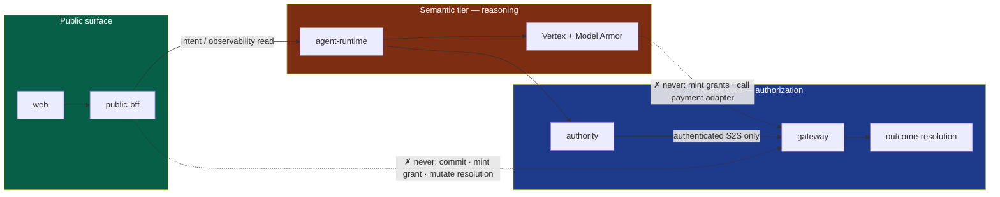

# Cloud Architecture (Phase 12)

**Principle:** Google Cloud implements infrastructure underneath existing ports. ADK orchestrates agents; TrueMandate governs them. Cloud adapters replace ports only — trust semantics and INV_001–INV_025 are unchanged.

## Co-located Cloud Run services

| Service | Responsibility | Public? |
|---------|----------------|---------|
| `intent-provenance` | Intent + Provenance | Private S2S |
| `authority` | Grants, tokens, exposure | Private S2S |
| `gateway` | TwoPhaseGateway only | **Private only — never anonymous** |
| `outcome-resolution` | Evidence + Outcome + Resolution | Private S2S |
| `agent-runtime` | ADK + ModelPort + Model Armor | Private S2S |
| `observability-api` | Read models / workspace | Private; BFF may call |
| `public-bff` | Human surface only | Network public; **Cloud Run identity required** |
| `web` | Static frontend | Public + `allUsers` invoker |
| `benchmark-runner` | SAFE eval (optional) | **No production economic authority** |

### Staging

1. **Foundation** — APIs, AR, SAs, IAM, Firestore, Pub/Sub pull, secrets, Model Armor  
2. **Images** — `scripts/cloud/deploy.sh`  
3. **Runtime** — Cloud Run, invokers, OIDC push  

See [deploy-guide](./deploy-guide.md), [public-access](./public-access.md), [iam-matrix.json](./iam-matrix.json).

### Why co-locate

Avoid microservice sprawl while preserving trust boundaries via **separate service accounts and IAM**. Logical packages remain independent; deploy units map to the table above.

## Service topology



## Trust boundaries



In text:

```
User → web → public-bff → (intent / observability read)
                ✗ never → Gateway commit / grant mint / resolution mutate

agent-runtime → Vertex + Model Armor → semantic services
                ✗ never → raw payment adapter / mint grants

Gateway ← authenticated S2S only ← authority / outcome-resolution
```

## Persistence

- `TM_PERSISTENCE=memory` — InMemory* + unit tests
- `TM_PERSISTENCE=firestore` — `@truemandate/cloud-firestore` adapters (production)
- CI uses `MemoryTransactionalStore` with Firestore TX semantics (emulator-equivalent)

## Events

`@truemandate/cloud-pubsub` envelopes all domain topics. Application-level dedupe is mandatory; transport exactly-once is never trusted.

## Observability vs provenance

Structured logs/traces carry **correlation IDs**. Cloud Trace is **not** the Intent Provenance Graph. Security events are first-class emissions on `security.events`.

## Related docs

- [IAM matrix](./iam-matrix.md) / [iam-matrix.json](./iam-matrix.json)
- [Firestore data model](./firestore-data-model.md)
- [Pub/Sub topology](./pubsub-topology.md)
- [Deploy guide](./deploy-guide.md)
- [Local + emulator](./local-emulator-guide.md)
- [Security boundaries](./cloud-security-boundaries.md)
- [Phase 12 stop report](../archive/phase-12-stop-report.md) *(archived)*
